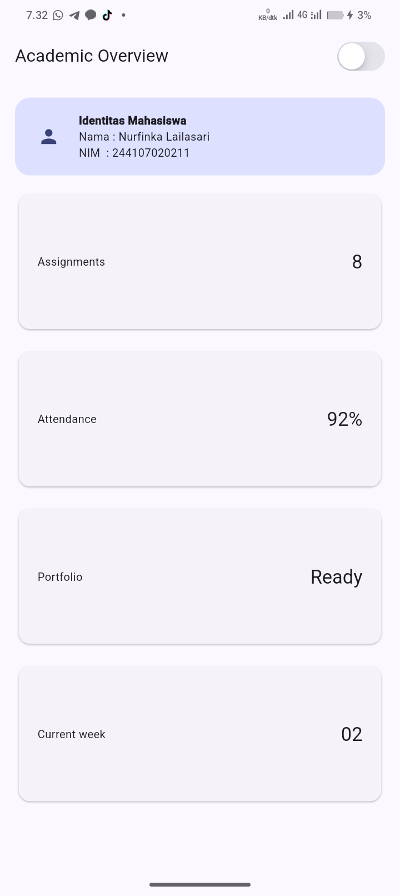
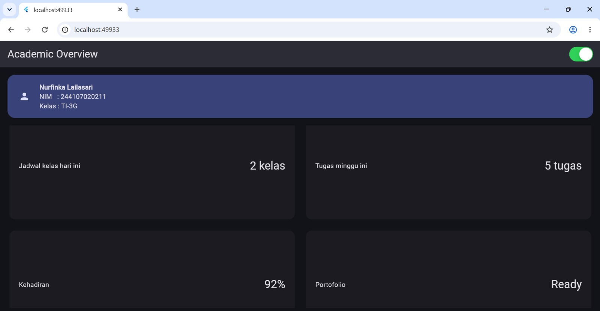
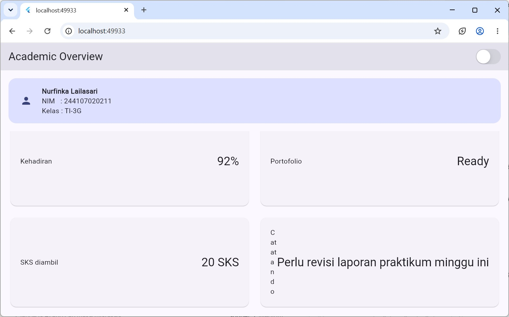
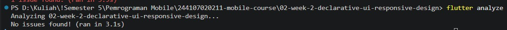

# Laporan Praktikum: Declarative UI & Responsive Design (Academic Overview Dashboard)

Repositori ini memuat implementasi antarmuka deklaratif dan tata letak responsif pada Flutter untuk dashboard **Academic Overview**, disertai dokumentasi perbandingan arsitektur UI berbasis AI Prompt Challenge, audit aksesibilitas, serta pengujian widget.

---

## 1. Tugas Utama & Hasil Tampilan

Dashboard akademik dikembangkan menjadi halaman **Academic Overview** yang responsif terhadap perubahan ukuran layar dengan memanfaatkan konsep *Declarative UI* dan adaptasi *layout breakpoint*.

### Tampilan Layar Sempit (Mobile / Portrait)
Pada tampilan layar sempit (< 700px), kartu informasi ditata secara vertikal (1 kolom) agar seluruh informasi tetap terbaca dengan jelas tanpa terpotong.



### Tampilan Layar Lebar (Tablet / Desktop / Landscape)
Pada tampilan layar lebar (≥ 700px), ruang horizontal dimanfaatkan secara optimal dengan menampilkan kartu informasi ke dalam 2 kolom.



---

## 2. AI Prompt Challenge: Eksplorasi Tata Letak

Eksplorasi AI digunakan untuk membandingkan dua pendekatan arsitektur tata letak untuk kartu informasi.

### A. Prompt Desain
> **Prompt:**  
> *"Untuk 4-5 kartu info dengan breakpoint sederhana, bandingkan GridView.count vs LayoutBuilder + Column/Wrap manual untuk dashboard akademik Flutter."*

* **Ringkasan Komparasi AI:**  
    
  * `GridView.count`: Lebih ringkas dan otomatis mengelola *spacing*, namun mengunci rasio dimensi setiap kartu melalui `childAspectRatio` (lebar : tinggi seragam).  
  * `LayoutBuilder` + `Wrap`: Fleksibel karena tinggi setiap kartu dapat menyesuaikan panjang kontennya (*intrinsic height*), namun memerlukan *boilerplate* kode yang lebih panjang.
* **Verifikasi Mandiri:**  
  Diuji dengan memasukkan teks panjang (*"Perlu revisi laporan praktikum minggu ini"*) ke dalam `GridView.count` dengan rasio `childAspectRatio: 2.6`. Hasilnya teks mengalami pemotongan/overflow karena batas tinggi kartu yang kaku. Saat rasio diubah menjadi `4.0`, kartu menjadi semakin pipih dan teks semakin terpotong. Hal ini membuktikan trade-off rasio tetap tersebut nyata.
* **Keputusan Akhir:**  
  Tetap menggunakan **`GridView.count`** dengan penambahan properti `overflow: TextOverflow.ellipsis` pada `InfoCard`.
* **Alasan Teknis:**  
  Jumlah kartu tergolong sedikit (5 kartu) dengan struktur konten yang seragam. Mempertahankan keseragaman visual (*visual alignment*) antar kartu lebih diprioritaskan dibanding fleksibilitas tinggi per-kartu.

---

### B. Audit Layout & Penanganan Overflow pada `Expanded`

> **Prompt:**  
> *"Jelaskan kapan penggunaan Expanded justru menyebabkan overflow di dalam Row, beri contoh kode yang gagal dan perbaikannya."*

* **Penjelasan Konsep:**  
  `Expanded` mengalokasikan sisa ruang yang tersedia dari flex parent-nya (`Row`/`Column`). Jika parent tidak memiliki batas dimensi pasti (*unbounded constraints*) pada sumbu utama—misalnya di dalam `SingleChildScrollView` horizontal—`Expanded` akan memicu error `RenderFlex overflowed by X pixels`.

#### Contoh Kasus: Kode Gagal (Overflow)
```dart
// SALAH: Expanded di dalam Row yang dibungkus SingleChildScrollView horizontal
// (Area scroll memiliki lebar tak terbatas/unbounded width constraint)
Widget buildGagal() {
  return SingleChildScrollView(
    scrollDirection: Axis.horizontal,
    child: Row(
      children: [
        Container(width: 100, color: Colors.red, child: const Text('A')),
        Expanded(
          // ERROR: RenderFlex overflowed / unbounded width constraint
          child: Container(color: Colors.blue, child: const Text('B')),
        ),
      ],
    ),
  );
}
```

#### Solusi Perbaikan
```dart
// BENAR: Menetapkan dimensi pasti dengan SizedBox untuk area scroll horizontal
Widget buildBenar() {
  return SingleChildScrollView(
    scrollDirection: Axis.horizontal,
    child: Row(
      children: [
        Container(width: 100, color: Colors.red, child: const Text('A')),
        SizedBox(
          width: 200, // Dimensi lebar eksplisit
          child: Container(color: Colors.blue, child: const Text('B')),
        ),
      ],
    ),
  );
}
```

#### Penerapan pada Project (`InfoCard`)
```dart
// AMAN: Card telah memiliki constraint lebar pasti dari GridView.count
Row(
  children: [
    Expanded(
      child: Text(title),
    ),
    Text(
      value,
      style: Theme.of(context).textTheme.headlineSmall,
      maxLines: 1,
      overflow: TextOverflow.ellipsis,
    ),
  ],
)
```

---

### C. Verification Prompt: Audit Desain & Aksesibilitas

> **Prompt:**  
> *"Periksa kembali rekomendasi layout di atas: apakah tetap responsif di bawah 600px, apakah mengurangi aksesibilitas, dan apakah ada widget yang tidak tersedia di Flutter stabil saat ini?"*

* **Temuan Audit:**
  1. **Responsivitas:** Aman di bawah 600px karena breakpoint beralih otomatis ke 1 kolom.
  2. **Aksesibilitas (A11y):** Terpenuhi; komponen utama (kartu profil, toggle tema, dan kartu info) didukung widget `Semantics`.
  3. **Stabilitas API:** Seluruh widget (`GridView.count`, `LayoutBuilder`, `CupertinoSwitch`, dan `Semantics`) menggunakan API Flutter stabil.
* **Keputusan Breakpoint:**  
  Breakpoint ditetapkan pada nilai **`700px`** (menggunakan konstanta `kWideBreakpoint`).
* **Alasan Teknis:**  
  Berdasarkan pengujian visual langsung pada emulator, lebar antara 600px–700px membuat kartu 2 kolom terasa terlalu padat jika mempertahankan padding konten yang ideal. Nilai 700px memberikan margin baca yang lebih seimbang.

---

## 3. Bukti Verifikasi & Pengujian

Integritas kode diverifikasi menggunakan analisis statis dan automated test suites bawaan Flutter:

* **Analisis Kode (`flutter analyze`):**  
  Berjalan bersih tanpa peringatan (*0 issues found*).  
  

* **Refactoring Challenge & Widget Testing (`flutter test`):**  
  Pengujian widget memastikan responsivitas beralih dengan benar antara mode 1 kolom dan 2 kolom.  
  .jpg)

```bash
$ flutter analyze
Analyzing project...
No issues found! (ran in 1.8s)

$ flutter test
00:02 +4: All tests passed!
```

---

## 4. Refleksi Pembelajaran

### 1. Perbedaan Cara Berpikir Imperative vs Declarative UI
* **Imperative:** Berfokus pada urutan langkah demi langkah (*how to change*) untuk memanipulasi elemen tampilan secara langsung saat status berubah.
* **Declarative (Flutter):** Berfokus pada penggambaran bentuk antarmuka (*what it looks like*) berdasarkan *state* saat ini. Cukup mendeklarasikan hierarki widget (`Column`, `Row`, `GridView`, `InfoCard`), dan *framework* Flutter yang akan menangani proses *render* ulang ketika data berubah.

### 2. Penggunaan `Expanded` dan Potensi Layout Error
* **Kapan Membantu:** Saat ingin sebuah widget membagi atau mengisi sisa ruang kosong yang tersedia pada sumbu utama flex parent-nya (misalnya: membiarkan `GridView` mengisi sisa area vertikal layar di bawah `ProfileCard`).
* **Kapan Menyebabkan Error:** Ketika diposisikan di dalam container berdimensi tak terbatas (*unbounded constraints*), seperti di dalam `SingleChildScrollView` atau `ListView` dengan sumbu sejajar. Tanpa batas ukuran dari parent, `Expanded` tidak dapat menghitung alokasi ruang sehingga memicu exception `RenderFlex overflowed`.

### 3. Pengaruh Breakpoint dan Theme terhadap UX
* **Breakpoint:** Memungkinkan layout beradaptasi secara dinamis dengan ukuran layar pengguna—beralih antara 1 kolom pada layar sempit dan 2 kolom pada layar lebar—sehingga hierarki informasi tetap ergonomis dibaca.
* **Theme:** Memberikan fleksibilitas visual dan kenyamanan ergonomis bagi pengguna melalui dukungan *Light Mode* dan *Dark Mode*, sekaligus mempermudah standardisasi palet warna secara terpusat melalui `Theme.of(context)`.

### 4. Hasil Verifikasi Akhir
Setelah implementasi selesai, verifikasi dilakukan dengan:
1. Memastikan modularitas komponen `InfoCard` dapat digunakan ulang (*reusable*) tanpa ketergantungan kaku.
2. Memastikan seluruh pewarnaan terikat dinamis pada `Theme.of(context)`.
3. Menggunakan konstanta baku `kWideBreakpoint` (700px) secara konsisten.
4. Menjalankan `flutter analyze` dan `flutter test` dengan hasil seluruh pengujian sukses (**+4: All tests passed!**).