# Week 5 — Offline Notes (Local Storage & Offline First)

## Tujuan
Membangun aplikasi catatan yang **offline-first**: bisa dibaca dan ditulis penuh
tanpa koneksi internet, lalu disinkronkan otomatis saat koneksi kembali. Project
ini menerapkan tiga pola inti offline-first — cache-first read, dirty flag, dan
antrean sinkronisasi — di atas kombinasi SharedPreferences (preferensi) dan
SQLite/sqflite (data terstruktur).

## Fitur utama
- **Preferensi tema**: toggle mode gelap/terang dan pencatatan waktu terakhir
  dibuka, disimpan via `SharedPreferences`.
- **CRUD catatan persisten**: tambah, lihat, ubah, hapus catatan lewat SQLite
  (`sqflite`), diakses hanya lewat `NoteRepository` + provider Riverpod — UI
  tidak pernah memanggil database langsung.
- **Offline-first**: cache-first read untuk data dari API (`cached_posts`),
  dirty flag pada setiap catatan yang belum tersinkron, dan fungsi `syncNotes()`
  untuk memproses antrean sync.
- **Badge & kontrol sync**: jumlah catatan `dirty` ditampilkan di halaman utama,
  dengan tombol "Sync sekarang" untuk memicu sinkronisasi manual.
- **Simulasi offline deterministik**: toggle `forceOffline` agar demo dan testing
  tidak bergantung pada kondisi Wi-Fi.
- **Detail catatan**: halaman detail via GoRouter (`/note/:id`) yang membaca
  langsung dari repository lokal, bukan dari state halaman list.
- **Teruji**: unit test untuk mapping model (`Note.fromMap`/`toMap`) dan test
  provider dengan `FakeNoteRepository` (tanpa menyentuh database sungguhan).

## Stack teknologi
- **Flutter** — framework UI
- **Riverpod** (`flutter_riverpod`) — state management (`AsyncNotifier`, `AsyncValue`)
- **sqflite** — SQLite untuk data terstruktur (catatan, cache posts)
- **shared_preferences** — penyimpanan key-value untuk preferensi
- **go_router** — routing (`/`, `/note/:id`, `/settings`)
- **http** — pengambilan data dari JSONPlaceholder (`GET /posts`)

## Cara menjalankan
```bash
flutter pub get
flutter run
```

Untuk menjalankan analisis dan test:
```bash
flutter analyze
flutter test
```

## Hasil yang dicapai
- Seluruh checklist mini project terpenuhi: preferensi tema via SharedPreferences,
  CRUD catatan via sqflite + Riverpod dengan urutan `updated_at` terbaru,
  mekanisme offline-first (cache-first, dirty flag, `syncNotes`) dengan aturan
  konflik **last-write-wins berdasarkan `updated_at`** yang didokumentasikan,
  serta minimal 2 test yang lulus (unit test model + test provider dengan
  repository palsu).
- Refactoring selesai: `NoteTile` diekstrak sebagai widget terpisah dengan
  badge "belum tersinkron", logika cache/sync dipindah ke `lib/data/sync.dart`
  agar repository tetap fokus pada CRUD, dan halaman detail catatan ditambahkan
  via GoRouter.
- AI Prompt Challenge dikerjakan dan diverifikasi: tabel perbandingan
  SharedPreferences vs Hive vs sqflite vs Drift, skema dengan index untuk skala
  1000+ catatan, serta AI Verification Checklist terjawab eksplisit (lihat
  `docs/ai-challenge.md`) — termasuk bagian rekomendasi AI mana yang ditolak
  dan alasannya.
- Aplikasi terbukti berfungsi penuh dalam mode pesawat (baca, tambah, hapus
  catatan tetap jalan), dengan badge dirty yang akurat sebelum dan sesudah sync
  (bukti: `screenshots/`).

## Refleksi

**Mengapa daftar catatan tidak boleh disimpan di SharedPreferences? Apa yang
rusak jika aturan ini dilanggar?**
SharedPreferences dirancang untuk pasangan key-value primitif tunggal, bukan
koleksi data. Kalau daftar catatan dipaksa masuk sebagai satu string JSON besar,
setiap operasi kecil — tambah satu catatan, ubah satu judul — harus membaca
seluruh string, decode semuanya, ubah satu elemen, lalu tulis ulang seluruh file.
Yang rusak: performa menurun seiring jumlah catatan bertambah (setiap perubahan
jadi O(n)), risiko korupsi data lebih tinggi kalau proses terhenti di tengah
penulisan string besar (bisa merusak seluruh koleksi, bukan cuma satu catatan),
tidak ada transaksi/locking sehingga dua penulisan bersamaan bisa saling
menimpa, dan tidak bisa filter/sort di level penyimpanan — semua harus
di-decode ke memori dulu baru diproses manual di Dart.

**Kapan cache-first cukup, dan kapan Anda membutuhkan strategi lain (misalnya
network-first untuk data harga real-time)?**
Cache-first cukup untuk data yang boleh sedikit basi — kontennya tidak sering
berubah dan kecepatan tampil/akses offline lebih penting daripada akurasi
detik-ini, seperti daftar post, profil, atau pengaturan. Strategi lain (mis.
network-first, atau stale-while-revalidate dengan indikator "mungkin belum
terbaru") dibutuhkan ketika data berubah cepat dan keputusan pengguna
bergantung pada nilai terkini — harga, stok, saldo, status pembayaran — karena
menampilkan data basi di kasus itu bisa menyebabkan kerugian nyata (transaksi
salah harga, double booking).

**Bagaimana dirty flag berubah menjadi antrean sync tanpa memblokir UI? Kapan
antrean terpisah (tabel outbox) menjadi perlu?**
Setiap perubahan lokal langsung disimpan ke SQLite dan ditandai `dirty = 1`,
lalu UI langsung membaca dari data lokal — tidak pernah menunggu jaringan.
Proses sync (`syncNotes()`) berjalan terpisah: mengambil semua baris `dirty = 1`,
mengirim ke server, dan baru menandai bersih setelah server konfirmasi sukses.
Karena UI selalu baca/tulis lewat SQLite lokal, dirty flag berfungsi sebagai
antrean implisit tanpa pernah memblokir UI. Tabel outbox terpisah menjadi perlu
ketika: perlu mencatat jenis operasi (create/update/delete) — delete tidak bisa
ditandai dirty di baris yang sudah dihapus; urutan pengiriman operasi penting
dan harus sesuai urutan asal; atau perlu retry policy per-operasi (jumlah
percobaan, error terakhir) yang tidak masuk akal ditempel di tabel `notes` itu
sendiri.

**Bagian mana dari rekomendasi AI yang Anda tolak, dan mengapa?**
Menolak saran "Drift untuk skala lebih besar" untuk project ini — boilerplate
awal Drift (setup `build_runner`, code generation) tidak sebanding manfaatnya
untuk satu tabel catatan sederhana. sqflite sudah cukup dan sesuai materi
minggu ini. Klaim reaktivitas native Drift (`.watch()`) juga tidak divalidasi
langsung di project ini (lihat `docs/ai-challenge.md` poin 3), jadi diperlakukan
sebagai klaim AI yang belum teruji, bukan alasan untuk beralih dari sqflite.

## Bukti screenshot (verifikasi mandiri)
Path gambar relatif terhadap `README.md` ini — pastikan nama file di folder
`screenshots/` persis sama (huruf besar/kecil ikut berpengaruh di GitHub).

**Mode pesawat / force-offline — aplikasi tetap berfungsi penuh:**

| Force-offline ON | Force-offline OFF |
|---|---|
| 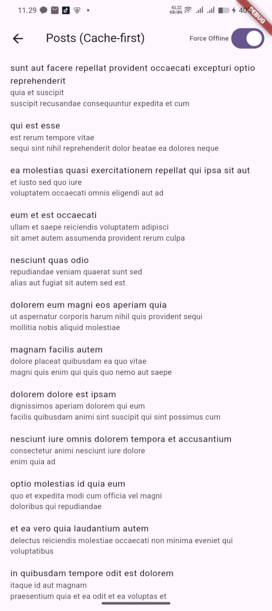 | 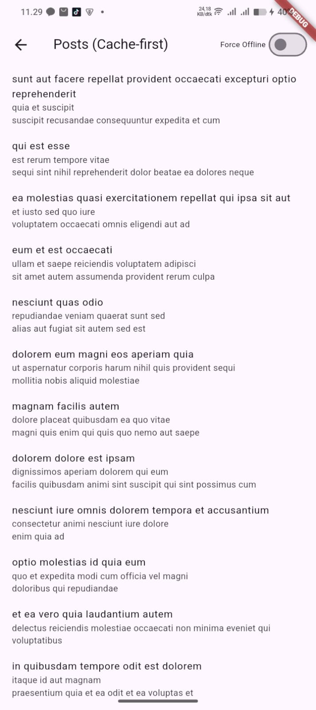 |

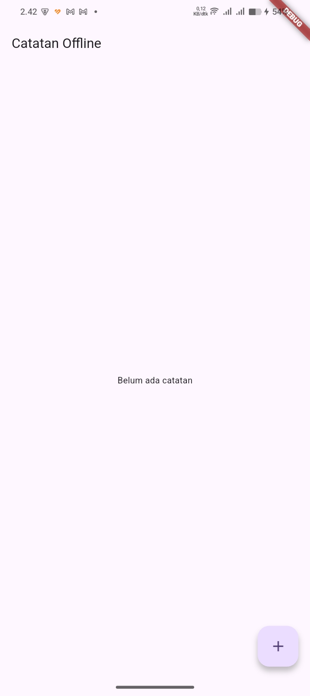
*State kosong: "Belum ada catatan yang perlu di-sync" saat tidak ada data dirty.*

**Tambah catatan (CRUD):**

| Dialog tambah catatan | Catatan tersimpan |
|---|---|
| 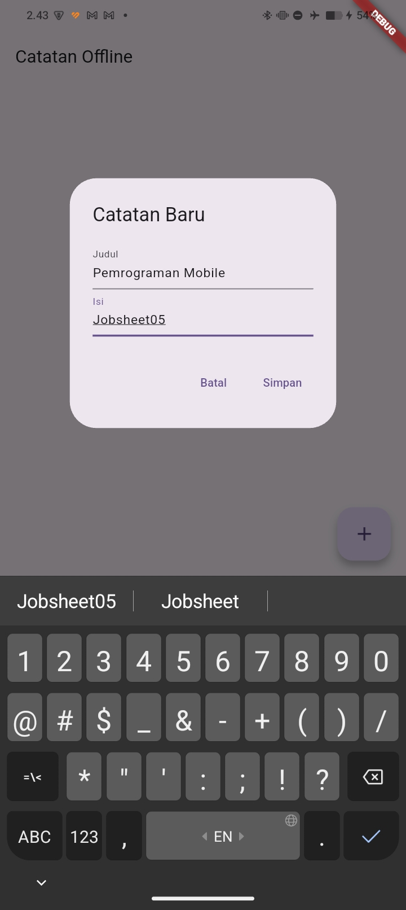 | 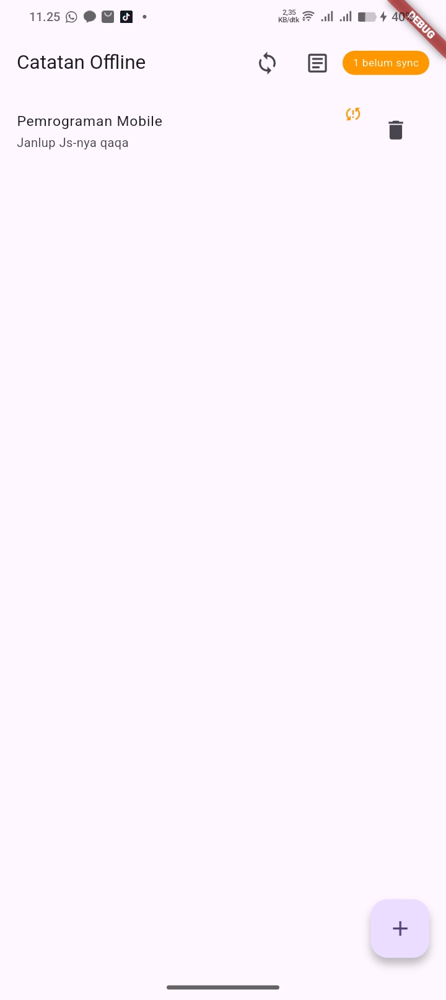 |

**Badge dirty sebelum & sesudah sync:**

| Sebelum sync (badge muncul) | Sesudah sync (badge hilang) |
|---|---|
| 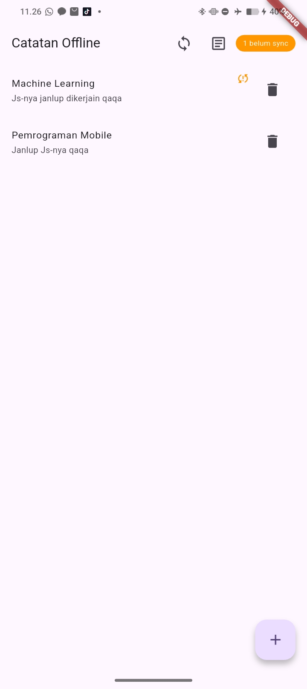 | 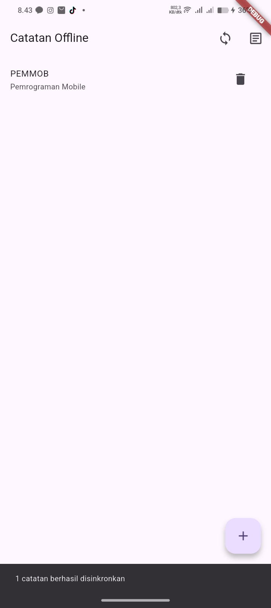 |

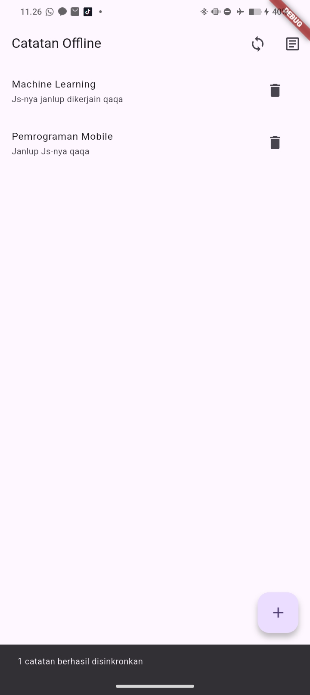
*Sync dijalankan saat tidak ada catatan dirty — tidak ada yang diproses.*

**Halaman detail catatan (GoRouter `/note/:id`):**

| List — belum sync | Detail — belum sync | Detail — sudah sync |
|---|---|---|
| 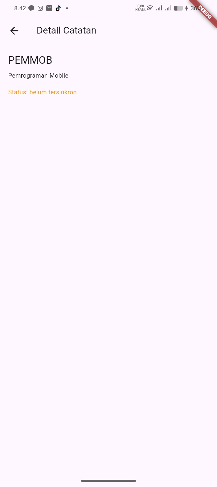 | 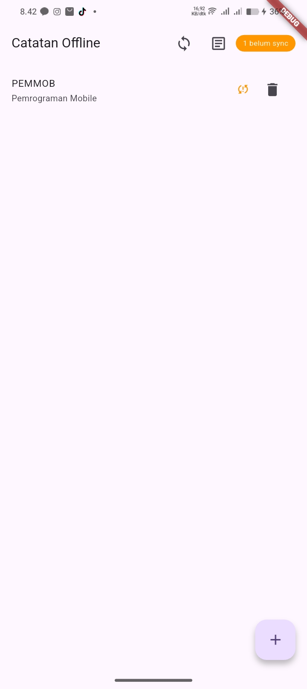 | 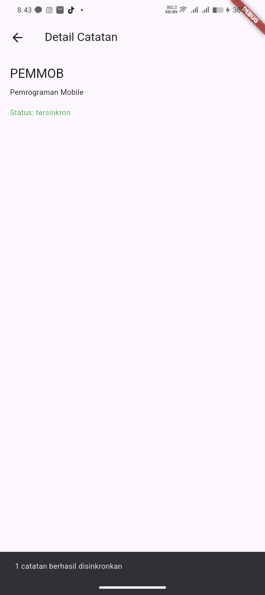 |


| `flutter analyze` | `flutter test` |
|---|---|
| 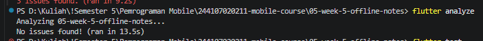 | 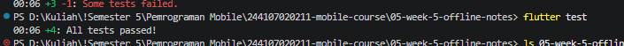